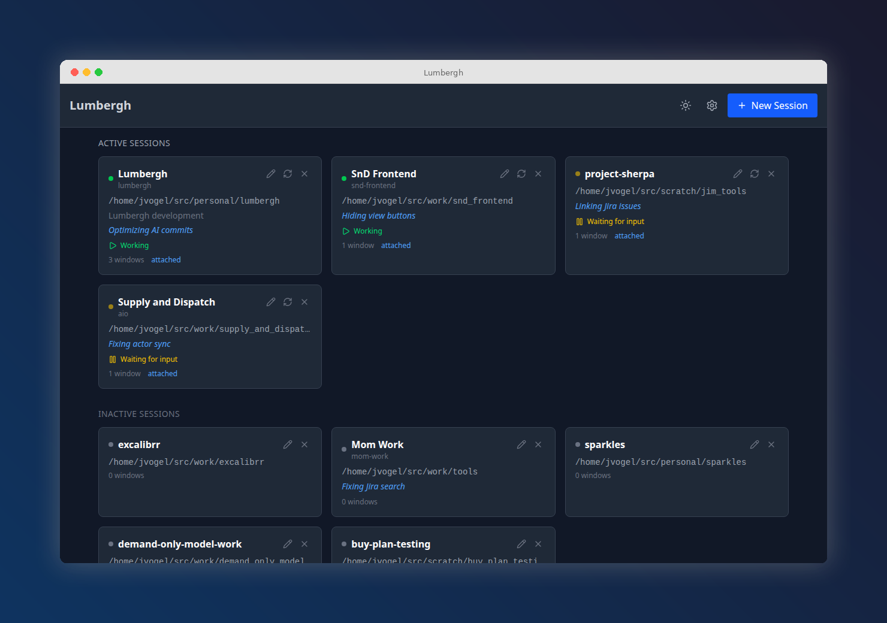

# Lumbergh

**Micromanage your AI interns.**

A self-hosted web dashboard for supervising multiple Claude Code sessions running in tmux. Watch diffs roll in, fire off prompts, check todos, and keep your AI workers on task -- all from your browser (or your phone).

[](https://pypi.org/project/pylumbergh/)
[](https://pypi.org/project/pylumbergh/)
[](LICENSE)
[](https://pypi.org/project/pylumbergh/)

**[Read the full documentation](https://voglster.github.io/lumbergh/)** -- guides, configuration, mobile/PWA setup, screenshots, and more.



## Install in 30 seconds

You need `tmux` and `git` on your machine. Then:

```bash
uv tool install pylumbergh
lumbergh
```

Open **http://localhost:8420**. Done.

### Windows

Lumbergh runs natively on Windows using [`psmux`](https://pypi.org/project/psmux/) (a PowerShell-based tmux clone) in place of tmux. WSL is not required.

```powershell
uv tool install psmux
uv tool install pylumbergh
lumbergh
```

`pywinpty` is installed automatically as a dependency.

> **What's uv?** [uv](https://docs.astral.sh/uv/) is a fast Python package manager from [Astral](https://astral.sh/). It handles installing Python tools in isolated environments so they don't conflict with anything else on your system. Install it with:
>
> ```bash
> curl -LsSf https://astral.sh/uv/install.sh | sh
> ```
>
> Don't want uv? `pip install pylumbergh` works too.

Lumbergh checks for tmux/git on startup and tells you what's missing.

## What you get

- **Multi-session dashboard** -- all your Claude Code sessions at a glance, with live status detection
- **Live terminals** -- interact with real terminal sessions via xterm.js + WebSockets
- **Git diff viewer** -- watch diffs, commits, and branch changes as the AI writes code
- **Git graph** -- interactive commit history visualization
- **File browser** -- browse project files with syntax highlighting
- **Manager AI** -- built-in AI chat pane for reviewing and coordinating work across sessions
- **Prompt templates** -- reusable prompts with variables, fire them with one click
- **Todos & scratchpad** -- per-project notes and task tracking
- **Shared files** -- share context across sessions
- **Mobile-first + PWA** -- responsive design, installable on your phone or tablet ([setup guide](https://voglster.github.io/lumbergh/docs/guides/mobile/))
- **Dark and light themes** -- toggle with one click

> *"Being able to code anywhere is a real game changer. Before, I had to lug around my laptop -- now I just pull out my phone."*
>
> -- @jcamierpy24

## Development

Want to contribute or hack on Lumbergh?

```bash
git clone https://github.com/voglster/lumbergh.git
cd lumbergh
./bootstrap.sh
```

This creates a tmux session with three windows (claude, backend, frontend) and opens `http://localhost:5420` with hot-reloading. You'll need **uv**, **npm**, and **Claude Code** in addition to tmux and git.

The Vite dev server proxies `/api` requests to the backend on port 8420, so the frontend and API appear same-origin during development.

**Tech stack:** Python 3.11+ / FastAPI / libtmux / TinyDB on the backend. React / Vite / TypeScript / xterm.js / Tailwind on the frontend.

Run `./lint.sh` before submitting PRs -- it handles formatting and catches errors.

## Links

- [Issues](https://github.com/voglster/lumbergh/issues)
- [Changelog](https://github.com/voglster/lumbergh/releases)

## License

MIT
