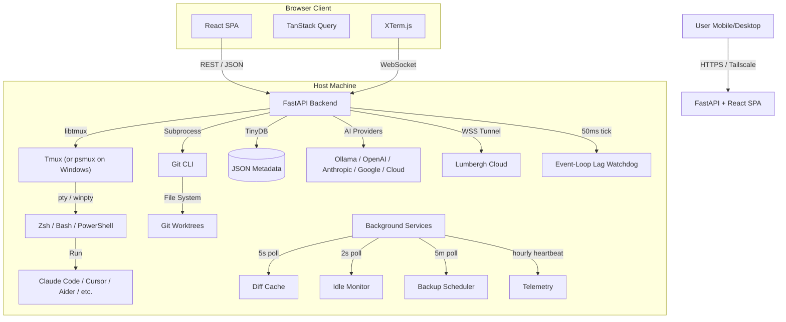

# Architecture

The system follows a decoupled client-server model. The backend serves a JSON API and WebSockets; the frontend is a React SPA. In production, the backend also serves the built frontend as static files.

## High-Level Overview

## Tech Stack

| Component | Choice | Rationale |
|-----------|--------|-----------|
| Language | Python 3.11+ | Required for libtmux and subprocess management |
| Web Framework | FastAPI | Async support for WebSockets, auto Swagger docs |
| Frontend | React + Vite + TypeScript | Robust ecosystem, PWA support |
| State | TanStack Query | Server state caching, ETag-aware polling for diffs |
| Terminal | xterm.js | Industry standard terminal emulator |
| Styling | Tailwind CSS | Utility-first CSS for responsive layouts |
| Persistence | TinyDB | Serverless, portable, human-readable JSON |
| AI Providers | Ollama, OpenAI, Anthropic, Google, OpenAI-compatible, Lumbergh Cloud | Multi-provider via common interface |
| Terminal mux | tmux (Linux/macOS), [psmux](https://pypi.org/project/psmux/) (Windows) | Native multiplexer on each platform; `libtmux` speaks both |
| PTY layer | `pty` (Unix), `pywinpty` (Windows) | Bidirectional terminal I/O without WSL |

## Middleware Stack

Requests pass through these layers in order:

1. **CORS** -- allow cross-origin requests (dev mode)
2. **AuthMiddleware** -- cookie-based ASGI middleware. Blocks unauthenticated requests to `/api/*` (except `/api/auth/*` and `/api/health`). Works for both HTTP and WebSocket.
3. **ETagMiddleware** -- computes MD5 hash of GET response bodies. Returns `304 Not Modified` if the client's `If-None-Match` header matches. Reduces bandwidth for polling clients.

## Data Flow

### Terminal Stream (WebSocket)

1. Client opens WebSocket to `ws://host/api/session/{name}/stream`
2. Backend spawns a PTY attached to the tmux pane via session pooling
3. Backend streams raw bytes to client via `xterm.write()`
4. Client keystrokes sent as JSON `{type: "input", data: "..."}`
5. Backend injects via `send-keys` (small text) or `load-buffer` + `paste-buffer` (large text)

### Live Diffs (Background Cache + ETag Polling)

1. A background `DiffCache` service runs every 5 seconds for active sessions
2. **Fingerprinting:** checks `.git/HEAD`, `.git/index`, `.git/refs/` mtimes + `git status --porcelain` hash. Skips expensive git commands if nothing changed.
3. **Compute:** runs `git diff HEAD` (including untracked files) in a thread pool
4. **Serve:** `GET /api/sessions/{name}/git/diff` returns cached data instantly
5. **Client:** TanStack Query polls with `If-None-Match`. Gets `304` when unchanged, full response when data is fresh.

### Idle Detection

1. Background `IdleMonitor` polls all live tmux sessions every 2 seconds
2. Captures recent pane content and matches against patterns (Claude spinner, approval prompts, rate limit messages, shell prompts, etc.)
3. **States:** `unknown` → `idle` → `working` → `error` → `stalled` (working > 10 min)
4. Persisted to TinyDB per-session with timestamps

### Authentication

1. Password set via `LUMBERGH_PASSWORD` env var or Settings UI
2. `POST /api/auth/login` validates password, sets `lumbergh_session` cookie (HMAC-SHA256 signed, 30-day expiry)
3. ASGI middleware checks cookie on every `/api/*` request
4. If no password is set, auth is completely bypassed

### Cloud Tunnel (Optional)

When the user signs in to Lumbergh Cloud, the backend opens an outbound
WebSocket tunnel from `tunnel.py` so a hosted dashboard at the cloud server
can proxy terminal streams back to this machine. The tunnel is purely
opt-in: with no `cloudToken` configured, no outbound connection is made.

### Telemetry & Heartbeat

If `telemetryConsent` is enabled, the backend fires a single startup ping and
a periodic hourly heartbeat (`telemetry.py`) so the project can track active
installs and version uptake. Telemetry is anonymous and OFF by default; the
first run shows a TelemetryOptIn banner.

### Event-Loop Lag Watchdog

A permanent watchdog runs as an asyncio task that sleeps for 50ms ticks. If
a tick takes more than 200ms (i.e. the loop was blocked), it dumps every
thread's stack — captured via `sys._current_frames()` — to
`/tmp/lumbergh-lag.log` so operators can diagnose UI hitches without
reproducing them under a profiler.

### Backup Scheduler

`backup_scheduler.py` runs every 5 minutes when Lumbergh Cloud is configured,
backing up sessions, todos, prompts, and settings to the cloud server.
Optional AES-256 encryption with a user-supplied passphrase keeps backups
unreadable to the server.

### Worktree Management

1. User configures a repo search directory in settings
2. App scans for directories containing `.git`
3. On session creation with worktree mode:
    - Validates the parent repo exists
    - Runs `git worktree add` with the specified branch
    - Creates tmux session in the worktree directory
    - Stores session metadata in TinyDB
