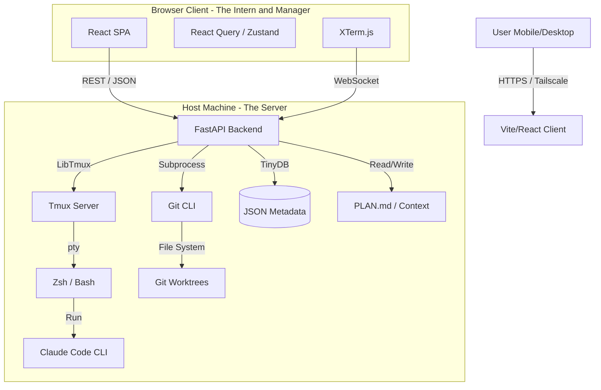

# Technical Architecture: Project Lumbergh

## 1. High-Level Architecture

The system follows a decoupled Client-Server model. The backend serves a JSON API and WebSockets; the frontend is a React Single Page Application (SPA).




## 2. Tech Stack Selection

| Component | Choice | Rationale |
|-----------|--------|-----------|
| Language | Python 3.11+ | Required for libtmux and robust subprocess management. |
| Web Framework | FastAPI | High-performance async support (crucial for WebSockets) and auto-generated Swagger docs for the React team. |
| Frontend Framework | React + Vite | Robust ecosystem for complex state (Chat, Todo Syncing). Enables "Install to Home Screen" (PWA). |
| State Management | TanStack Query | Handles the polling of Git Diffs and "Server State" caching perfectly. |
| Mobile Strategy | Responsive Web | Primary target. The JSON API allows a future Expo/React Native app if native features (notifications) are needed. |
| Terminal Widget | xterm.js | Industry standard. Wrapped in a React component for lifecycle management. |
| Styling | Tailwind CSS | Utility-first CSS for rapid, reliable mobile layouts. |
| Persistence | TinyDB | Serverless, document-oriented database stored in `~/.lumbergh/db.json`. Portable and human-readable. |

## 3. Data Flow

### 3.1 Terminal Stream (WebSocket)

1. **Connect:** React Client opens WebSocket to `ws://host/api/session/{uuid}/stream`.
2. **Attach:** Backend spawns a pty attached to the specific tmux pane using `tmux attach`.
3. **Read (Host → Client):** Backend streams raw bytes. React passes them to `xterm.write()`.
4. **Write (Client → Host):** React captures keystrokes (or Virtual Keyboard input) and sends to Backend. Backend injects via `pane.send_keys()`.

### 3.2 Live Diffs (Polling/JSON)

1. **Trigger:** React Query polls `/api/session/{uuid}/diff` every 3-5 seconds.
2. **Execution:** Backend runs `git diff HEAD` in the worktree.
3. **Response:** Backend returns JSON:

```json
{
  "files": ["src/App.tsx", "README.md"],
  "stats": { "insertions": 12, "deletions": 4 },
  "raw_output": "diff --git a/src..."
}
```

4. **Render:** React parses the raw diff (using `react-diff-view` or similar) and renders a color-coded UI.

### 3.3 The Manager & Context (RAG)

1. **Ingest:** Backend watches `PLAN.md` and `docs/*.md`.
2. **Query:** User chats with "Manager Agent" in React UI.
3. **Process:**
   - Backend assembles context: Diff + Plan + Ticket Info.
   - Sends prompt to LLM (Anthropic/OpenAI).
4. **Tool Use:** If LLM decides to "Update Plan", Backend writes to `PLAN.md` on disk.
5. **Sync:** React Query invalidates the "Plan" cache, causing the UI to re-fetch and display the updated Todo list.

## 4. Worktree Management Strategy

To ensure safety, Lumbergh prioritizes the Worktree Flow:

1. **Root Config:** User defines `PROJECTS_DIR` (e.g., `~/code`) in settings.
2. **Discovery:** App scans `PROJECTS_DIR` for directories containing `.git`.
3. **Creation Logic (The "Annex"):**
   - **API Call:** `POST /api/sessions` with `{ repo: "my-app", branch: "feat/login" }`.
   - **Backend Action:**
     1. Checks if `~/code/my-app` exists.
     2. Runs `git worktree add ../my-app-worktrees/feat-login feat-login`.
     3. Creates tmux session `lumbergh_feat_login` in that directory.
     4. Creates entry in TinyDB.
   - **Response:** Returns Session UUID.

## 5. Persistence Schema (TinyDB)

Data is stored in `~/.lumbergh/db.json`.

```json
{
  "_default": {
    "1": {
      "uuid": "550e8400-e29b...",
      "name": "Jira-123: Auth Fix",
      "repo_path": "/home/user/code/app",
      "worktree_path": "/home/user/code/worktrees/app-auth",
      "tmux_session": "lumbergh_550e8400",
      "created_at": 1698412000,
      "status": "active"
    }
  }
}
```

