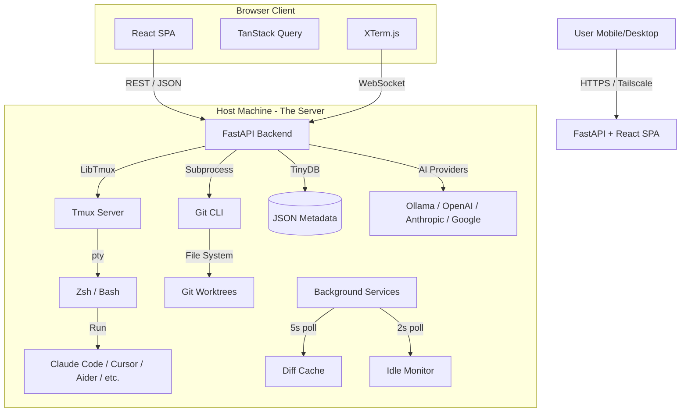

# Technical Architecture: Project Lumbergh

## 1. High-Level Architecture

The system follows a decoupled Client-Server model. The backend serves a JSON API and WebSockets; the frontend is a React Single Page Application (SPA). The backend also serves the built frontend as static files in production.


```mermaid
graph TD
    User[User Mobile/Desktop] -->|HTTPS / Tailscale| App[FastAPI + React SPA]

    subgraph Host Machine - The Server
        API[FastAPI Backend] -->|LibTmux| Tmux[Tmux Server]
        API -->|Subprocess| Git[Git CLI]
        API -->|TinyDB| DB[(JSON Metadata)]
        API -->|AI Providers| AI[Ollama / OpenAI / Anthropic / Google]

        Tmux -->|pty| Shell[Zsh / Bash]
        Shell -->|Run| Claude[Claude Code / Cursor / Aider / etc.]

        Git -->|File System| Worktrees[Git Worktrees]

        BG[Background Services]
        BG -->|5s poll| DiffCache[Diff Cache]
        BG -->|2s poll| IdleMonitor[Idle Monitor]
    end

    subgraph Browser Client
        React[React SPA]
        Store[TanStack Query]
        Term[XTerm.js]
    end

    React -->|REST / JSON| API
    Term -->|WebSocket| API
```


## 2. Tech Stack

| Component | Choice | Rationale |
|-----------|--------|-----------|
| Language | Python 3.11+ | Required for libtmux and robust subprocess management. |
| Web Framework | FastAPI | Async support for WebSockets, auto-generated OpenAPI docs. |
| Frontend | React + Vite + TypeScript | Robust ecosystem. PWA-capable for mobile "install to home screen". |
| State Management | TanStack Query | Handles polling of git diffs and server state caching with ETag support. |
| Terminal Widget | xterm.js | Industry standard terminal emulator for the web. |
| Styling | Tailwind CSS | Utility-first CSS for rapid, responsive mobile layouts. |
| Persistence | TinyDB | Serverless JSON document store in `~/.config/lumbergh/`. Portable and human-readable. |
| AI Providers | Ollama, OpenAI, Anthropic, Google, OpenAI-compatible | Multi-provider architecture via common interface. |

## 3. Middleware Stack

Requests pass through these layers in order:

1. **CORS** — Allow cross-origin requests (dev mode)
2. **AuthMiddleware** — Cookie-based ASGI middleware. Blocks unauthenticated requests to `/api/*` (except `/api/auth/*` and `/api/health`). Works for both HTTP and WebSocket.
3. **ETagMiddleware** — Computes MD5 hash of GET response bodies. Returns `304 Not Modified` if the client's `If-None-Match` header matches. Reduces bandwidth for polling clients.

## 4. Data Flow

### 4.1 Terminal Stream (WebSocket)

1. **Connect:** Client opens WebSocket to `ws://host/api/session/{name}/stream`.
2. **Attach:** Backend spawns a pty attached to the tmux pane via session pooling.
3. **Read (Host → Client):** Backend streams raw bytes. Client passes to `xterm.write()`.
4. **Write (Client → Host):** Client sends keystrokes as JSON `{type: "input", data: "..."}`. Backend injects via tmux `send-keys` (small text) or `load-buffer` + `paste-buffer` (large text).
5. **Resize:** Client sends `{type: "resize", cols: N, rows: M}`.

### 4.2 Live Diffs (Background Cache + ETag Polling)

1. **Background:** `DiffCache` service runs every 5 seconds for active sessions.
2. **Fingerprint:** Checks `.git/HEAD`, `.git/index`, `.git/refs/` mtimes + `git status --porcelain` hash. Skips expensive git commands if nothing changed.
3. **Compute:** Runs `git diff HEAD` including untracked files in a thread pool.
4. **Serve:** `GET /api/sessions/{name}/git/diff` returns cached data instantly.
5. **Client:** TanStack Query polls with `If-None-Match`. Gets `304` when unchanged, full response when data is fresh.

### 4.3 Idle Detection

1. **Background:** `IdleMonitor` polls all live tmux sessions every 2 seconds.
2. **Detection:** Captures recent pane content and matches against patterns (Claude spinner, approval prompts, rate limit messages, shell prompts, etc.).
3. **States:** `unknown` → `idle` → `working` → `error` → `stalled` (working > 10 min).
4. **Storage:** Persisted to TinyDB per-session with timestamps.
5. **Display:** Dashboard shows colored status indicators per session card.

### 4.4 Authentication

1. **Config:** Password set via `LUMBERGH_PASSWORD` env var or `~/.config/lumbergh/settings.json`.
2. **Login:** `POST /api/auth/login` validates password, sets `lumbergh_session` cookie (HMAC-SHA256 signed, 30-day expiry).
3. **Middleware:** ASGI middleware checks cookie on every `/api/*` request. Returns 401 (HTTP) or closes with code 4401 (WebSocket) if invalid.
4. **Disabled:** If no password is set, auth is completely bypassed.

## 5. Persistence Schema (TinyDB)

Data is stored across multiple files in `~/.config/lumbergh/`:

### Global Settings (`settings.json`)
```json
{
  "repoSearchDir": "/home/user",
  "gitGraphCommits": 100,
  "defaultAgent": "claude-code",
  "password": "",
  "ai": {
    "provider": "ollama",
    "providers": {
      "ollama": {"baseUrl": "http://localhost:11434", "model": "llama3"},
      "anthropic": {"apiKey": "...", "model": "claude-sonnet-4-20250514"}
    }
  }
}
```

### Session Registry (`sessions.json`)
```json
{
  "sessions": {
    "my-feature": {
      "workdir": "/home/user/code/app",
      "description": "Working on auth fix",
      "displayName": "Auth Fix",
      "paused": false,
      "agentProvider": "claude-code",
      "type": "direct",
      "lastUsedAt": "2026-03-17T10:00:00Z",
      "idleState": "working",
      "idleStateUpdatedAt": "2026-03-17T10:05:00Z"
    }
  }
}
```

### Project Data (`projects/{repo_hash}.json`)
Per-project todos, scratchpad, and prompt templates (shared across sessions pointing at the same repo).

### Global Data (`global.json`)
Shared prompt templates accessible from all projects.

### Shared Files (`shared/`)
User-uploaded files for cross-project context sharing.

## 6. AI Provider Architecture

All providers implement a common interface (`BaseProvider`):
- `health_check() -> bool` — Is the provider reachable?
- `complete(prompt: str) -> str` — Single-turn completion.

Supported providers:
| Provider | Config | Notes |
|----------|--------|-------|
| Ollama | `baseUrl`, `model` | Local LLM, also supports model listing |
| OpenAI | `apiKey`, `model` | GPT-4o and variants |
| Anthropic | `apiKey`, `model` | Claude models |
| Google | `apiKey`, `model` | Gemini with thinking config |
| OpenAI-compatible | `baseUrl`, `apiKey`, `model` | vLLM, text-generation-inference, etc. |
| Lumbergh Cloud | Cloud account (device code auth) | Free, no API key needed |

Used for: commit message generation, prompt name generation, session status summaries.

## 7. Agent Provider Registry

Lumbergh can launch different AI coding agents per session:
- **Claude Code** (default) — `claude`
- **Cursor** — `cursor`
- **OpenCode** — `opencode`
- **Gemini CLI** — `gemini`
- **Aider** — `aider`
- **Codex** — `codex`

Configurable globally via `defaultAgent` setting or per-session via `agentProvider` metadata.
