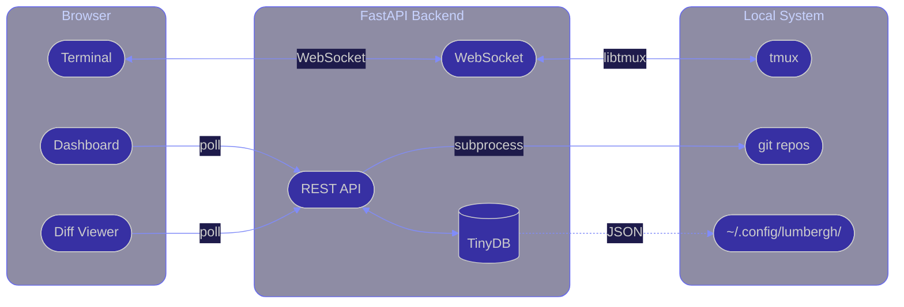

<div class="flex items-center justify-center h-full">
<div class="text-center">

# Lumbergh

### *"Yeah, if you could just supervise all your AI agents from one dashboard... that'd be great."*


<p class="mt-6 text-sm opacity-60">Be Lumbergh. Micromanage all your AIs.</p>

</div>
</div>

<style>
h1 {
  font-size: 3.5em !important;
  background: linear-gradient(135deg, #667eea 0%, #764ba2 100%);
  -webkit-background-clip: text;
  -webkit-text-fill-color: transparent;
}
</style>

<!--
Hi, I'm Jim. I've been running multiple Claude Code agents in parallel for months now, and I built a tool to keep them from going off the rails. It's called Lumbergh -- named after everyone's favorite micromanager.
-->

---
layout: image-right
image: /images/cat-laptop.jpg
---

# The Problem

You're running 5 Claude Code sessions.

<br>

- Tab 47: *"I refactored your auth module"* -- you didn't ask
- Tab 48: stuck on a prompt, burning tokens
- Tab 49: you forgot this one exists
- Your mental model of the plan decays every 30 minutes

<!--
If you're using Claude Code or Cursor or any AI coding agent, you've probably hit this. You spin up a few sessions, and within 20 minutes you've lost track. One is doing something you didn't ask for, another is burning tokens waiting for input, and there's one you completely forgot about. Your brain can't hold the state of 5 parallel agents.
-->

---
layout: center
---

# Why Not Just Terminal Tabs?

<br>

- You can't see what 5 agents are doing **at once**
- You can't see their git diffs **without switching context**
- You can't check on them **from your phone while making coffee**
- You can't hand someone a URL and say "watch these"

<!--
The obvious question: just use terminal tabs. But tabs are sequential -- you can only look at one at a time. You can't glance at a dashboard and see all 5 agents at once. You definitely can't pull out your phone while getting coffee and check on them. And you can't share a URL with a teammate so they can watch your agents work.
-->

---

# The Solution


<!--
So I built this. One dashboard, all your sessions. Each card shows the session name, what it's working on, its current status, and the repo path. Green dot means active, yellow means waiting for input. You can click into any session to get the full view.
-->

---

# What You Get

<div class="grid grid-cols-4 gap-4 mt-6 px-4">
<div class="text-center">

<p class="text-sm mt-3 font-medium">Terminal</p>
</div>
<div class="text-center">

<p class="text-sm mt-3 font-medium">Git + Commits</p>
</div>
<div class="text-center">

<p class="text-sm mt-3 font-medium">Todos & Notes</p>
</div>
<div class="text-center">

<p class="text-sm mt-3 font-medium">File Browser</p>
</div>
</div>

<!--
When you click into a session, you get four tabs. Terminal is a full xterm.js terminal over WebSocket -- you can type, scroll, everything. Git tab shows live diffs and a metro-style commit graph as the agent works. Todos let you track what each agent should be working on. And the file browser lets you browse the repo without leaving the dashboard.
-->

---
layout: center
---

# Batteries Included

<div class="grid grid-cols-3 gap-x-12 gap-y-10 mt-6 px-8">

<div class="text-center">
<div class="text-4xl mb-2">🌳</div>
<div class="font-bold">Worktrees</div>
<div class="text-sm opacity-70 mt-1">One-click isolated feature branches</div>
</div>

<div class="text-center">
<div class="text-4xl mb-2">🎯</div>
<div class="font-bold">Prompt Templates</div>
<div class="text-sm opacity-70 mt-1">Variables + one-click fire at any session</div>
</div>

<div class="text-center">
<div class="text-4xl mb-2">🔌</div>
<div class="font-bold">Pluggable AI</div>
<div class="text-sm opacity-70 mt-1">Anthropic, OpenAI, Google, Ollama</div>
</div>

<div class="text-center">
<div class="text-4xl mb-2">🚇</div>
<div class="font-bold">Git Graph</div>
<div class="text-sm opacity-70 mt-1">Metro-style commit visualization</div>
</div>

<div class="text-center">
<div class="text-4xl mb-2">📱</div>
<div class="font-bold">PWA + Tailscale</div>
<div class="text-sm opacity-70 mt-1">Install on phone, access from anywhere</div>
</div>

<div class="text-center">
<div class="text-4xl mb-2">🔗</div>
<div class="font-bold">Shared Context</div>
<div class="text-sm opacity-70 mt-1">Cross-session files for coordinating agents</div>
</div>

</div>

<!--
Quick feature tour. Worktrees: one click to spin up an isolated git branch for each agent so they don't step on each other. Prompt templates with variables -- write once, fire at any session. Pluggable AI provider for the manager chat. Git graph shows the commit history as a metro map. PWA so you can install it on your phone -- combine with Tailscale and you can check your agents from anywhere. And shared context files that all agents can read, so you can coordinate them.
-->

---

# Mobile-First

<div class="flex justify-center gap-8 mt-4">
<div class="text-center">

<p class="text-sm mt-2 opacity-70">Check on your agents</p>
</div>
<div class="text-center">

<p class="text-sm mt-2 opacity-70">Review their code</p>
</div>
</div>

<!--
This is what it looks like on your phone. Left is the dashboard -- you can see all your sessions, their status, what they're working on. Right is the git tab from inside a session -- full diff view, commit graph, you can even commit and push from your phone. I use this constantly -- kick off a few agents, go make coffee, check on them from my phone.
-->

---
layout: center
---

# Architecture

<br>



<p class="mt-8 text-center text-lg opacity-70">~5k lines of Python. No Postgres, no Redis, no Docker.</p>

<!--
The architecture is deliberately boring. React frontend talks to a FastAPI backend. Terminal streams over WebSocket -- the backend uses libtmux to attach to tmux sessions and pipe the PTY data. Everything else is REST polling -- git diffs, file listings, session metadata. TinyDB for persistence -- just JSON files in ~/.config/lumbergh. No Postgres, no Redis, no Docker, no message queue. About 5k lines of Python total. The whole thing runs as two processes: backend and frontend dev server.
-->

---

# The Interesting Bit

```python
# The whole terminal -- a WebSocket, a PTY, and asyncio
@app.websocket("/ws/terminal/{session}/{pane}")
async def terminal_ws(websocket: WebSocket, session: str, pane: str):
    await websocket.accept()
    pty = session_manager.attach(session, pane)

    async for data in pty.stream():
        await websocket.send_bytes(data)

# Live diffs -- just shell out to git
@app.get("/api/diff/{session}")
async def get_diff(session: str):
    result = subprocess.run(
        ["git", "diff", "--stat", "--patch"],
        capture_output=True, cwd=session_path
    )
    return parse_diff(result.stdout)
```

<div class="mt-4 p-3 bg-yellow-500/10 rounded-lg border border-yellow-500/20 text-center">
FastAPI makes the async plumbing almost invisible.
</div>

<!--
Here's what the core looks like. The terminal endpoint is 6 lines -- accept a WebSocket, attach to the tmux pane via libtmux, stream the bytes. That's it. The diff endpoint is even simpler -- just shell out to git and parse the output. FastAPI's async support makes this almost trivial. The session_manager handles PTY pooling so multiple browser tabs can watch the same session without spawning extra processes.
-->

---
layout: center
class: text-center
---

# Demo Time


<p class="mt-4 text-2xl italic opacity-70">"I was told there would be a live demo."</p>

<div class="mt-4 grid grid-cols-3 gap-6 text-sm opacity-50 max-w-lg mx-auto">
<div>WiFi works: <span class="text-green-500 font-bold">TBD</span></div>
<div>tmux alive: <span class="text-green-500 font-bold">TBD</span></div>
<div>Agents behaving: <span class="text-red-500 font-bold">lol</span></div>
</div>

<!--
Alright, let's see if this actually works. I've got a few agents running right now -- let me switch over to the dashboard and walk you through it live.

DEMO PLAN:
1. Show dashboard with active sessions
2. Click into a session, show terminal tab
3. Switch to Git tab -- show live diff
4. Show the commit graph
5. Quick look at mobile view if time permits
6. Fire a prompt template at a session
-->

---
layout: center
class: text-center
---

# Try It Tonight

<div class="mt-4">

```bash
git clone https://github.com/voglster/lumbergh
cd lumbergh && ./bootstrap.sh
```

</div>

<p class="mt-4 opacity-70">Checks prerequisites, installs deps, opens the dashboard.<br>No Docker. No database. No config files.</p>

<div class="mt-8 flex justify-center gap-12">

<div class="text-center">

<p class="text-sm mt-2 opacity-70">github.com/voglster/lumbergh</p>
</div>

</div>

<style>
h1 {
  font-size: 3em !important;
  background: linear-gradient(135deg, #667eea 0%, #764ba2 100%);
  -webkit-background-clip: text;
  -webkit-text-fill-color: transparent;
  padding-bottom: 0.2em;
}
</style>

<!--
Two commands. The bootstrap script checks for Python, Node, and tmux, installs dependencies with uv and npm, and opens the dashboard. No Docker, no database migrations, no config files to create. If you're already running Claude Code in tmux, it'll pick up your existing sessions automatically.

Star the repo, file issues, PRs welcome. Thanks!
-->
