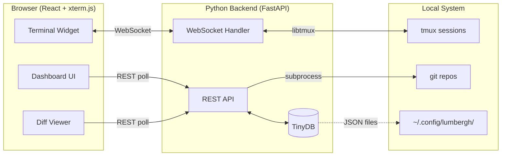

<div class="flex items-center justify-center h-full">
<div class="text-center">

# Lumbergh

### *"Yeah, if you could just supervise all your AI agents from one dashboard... that'd be great."*


<p class="mt-6 text-sm opacity-60">Built with Python + FastAPI | A talk for Python Meetup</p>

</div>
</div>

<style>
h1 {
  font-size: 3.5em !important;
  background: linear-gradient(135deg, #667eea 0%, #764ba2 100%);
  -webkit-background-clip: text;
  -webkit-text-fill-color: transparent;
}
</style>

---
layout: image-right
image: /images/cat-laptop.jpg
---

# The Problem

### Managing multiple AI agents is like herding cats

<br>

<v-clicks>

- **Herding Cats** -- 20+ concurrent AI sessions, losing track of who's doing what
- **Context Switching** -- Alt-tabbing between terminals burns mental energy
- **Drift Detection** -- Agents go off-task and you don't notice until it's too late
- **Context Fragmentation** -- Plans in your head, code in terminals, nothing connected

</v-clicks>

---

# The Solution

### One dashboard to rule them all

<div class="grid grid-cols-2 gap-4 mt-4">

<div>

<v-clicks>

- Bird's-eye view of every active session
- Live terminal streaming via WebSockets
- Real-time git diff monitoring
- Context & planning tools alongside each session
- Works from your phone or tablet

</v-clicks>

</div>

<div>

<v-click>

</v-click>

</div>

</div>

---

# Why Python?

### The right tool for the glue layer

<br>

<v-clicks>

- **FastAPI** -- async WebSockets + REST in one framework
- **libtmux** -- first-class Python bindings for tmux
- **subprocess** -- shelling out to `git diff` is the right call
- **TinyDB** -- pure Python, zero-config JSON document store
- **uvicorn** -- ASGI server, handles concurrent WebSocket streams

</v-clicks>

<br>

<v-click>

<div class="p-4 bg-blue-500/10 rounded-lg border border-blue-500/20">

> The backend is ~500 lines of Python. That's it.

</div>

</v-click>

<style>
h1 {
  background: linear-gradient(135deg, #3776AB 0%, #FFD43B 100%);
  -webkit-background-clip: text;
  -webkit-text-fill-color: transparent;
}
</style>

---
layout: two-cols
---

# The Office Floor

Your command center for all AI sessions

<br>

<v-clicks>

- Session cards with live status
- Quick-launch into any session
- Create sessions from existing repos
- Auto-create git worktrees

</v-clicks>

::right::

<br><br>

### Session States

| Status | Meaning |
|--------|---------|
| Typing Furiously | Working |
| Sipping Coffee | Idle |
| Jamming the Printer | Error |
| Asleep at the Desk | Stalled 10m+ |
| Called in Sick | Offline |

<style>
table {
  font-size: 0.85em;
}
</style>

---

# The Cubicle

### Single session deep-dive with three panes

<div class="grid grid-cols-3 gap-3 mt-6">

<div class="text-center">

**The Intern** -- Terminal


</div>

<div class="text-center">

**The Review** -- Git Diffs


</div>

<div class="text-center">

**The Manager** -- Todos & Context


</div>

</div>

---

# Architecture

<div class="mt-2">



</div>

<v-click>

<div class="mt-4 p-3 bg-blue-500/10 rounded-lg border border-blue-500/20 text-center">
No Postgres, no Redis, no Docker -- just Python + tmux
</div>

</v-click>

---

# The Python Backend

```python {all|1-3|5-8|10-15|all}
# Terminal streaming -- WebSocket + libtmux
@app.websocket("/ws/terminal/{session}/{pane}")
async def terminal_ws(websocket: WebSocket, session: str, pane: str):
    await websocket.accept()
    pty = session_manager.attach(session, pane)

    async for data in pty.stream():
        await websocket.send_bytes(data)

# Live diffs -- subprocess + JSON
@app.get("/api/diff/{session}")
async def get_diff(session: str):
    result = subprocess.run(
        ["git", "diff", "--stat", "--patch"],
        capture_output=True, cwd=session_path
    )
    return parse_diff(result.stdout)
```

<v-click>

<div class="mt-4 p-3 bg-yellow-500/10 rounded-lg border border-yellow-500/20 text-center">
FastAPI makes the async plumbing almost invisible.
</div>

</v-click>

---

# Key Design Choices

<br>

<div class="grid grid-cols-2 gap-4">

<v-clicks>

<div class="p-3 bg-gray-500/10 rounded-lg">

**Self-hosted** -- Your code never leaves your machine

</div>

<div class="p-3 bg-gray-500/10 rounded-lg">

**Tmux-native** -- Works with your existing workflow

</div>

<div class="p-3 bg-gray-500/10 rounded-lg">

**No external DB** -- TinyDB + markdown, zero setup

</div>

<div class="p-3 bg-gray-500/10 rounded-lg">

**Mobile-first** -- Manage agents from your couch

</div>

<div class="p-3 bg-gray-500/10 rounded-lg">

**Thin backend** -- Just a bridge between browser and tmux/git

</div>

<div class="p-3 bg-gray-500/10 rounded-lg">

**`subprocess` > libraries** -- the `git` CLI is the best git library

</div>

</v-clicks>

</div>

---

# Demo Time

<div class="flex items-center justify-center h-4/5">
<div class="text-center">


### *"Yeah, if you could just watch this demo... that'd be great."*

<br>

1. Dashboard overview
2. Open a session
3. Watch live diffs
4. Context & planning tools

</div>
</div>

---
layout: center
class: text-center
---

# Thanks!

<div class="flex items-center justify-center gap-12 mt-4">

<div>

### Python + FastAPI + libtmux + TinyDB

That's the whole backend.

<br>

<div class="text-sm opacity-60">

*"Yeah, if you could just star the repo... that'd be great."*

</div>

</div>

<div>


<a href="https://github.com/voglster/lumbergh" class="text-sm mt-2 block opacity-70">github.com/voglster/lumbergh</a>

</div>

</div>

<style>
h1 {
  font-size: 3em !important;
  background: linear-gradient(135deg, #667eea 0%, #764ba2 100%);
  -webkit-background-clip: text;
  -webkit-text-fill-color: transparent;
}
</style>
